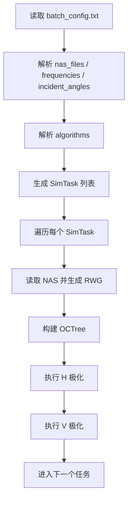
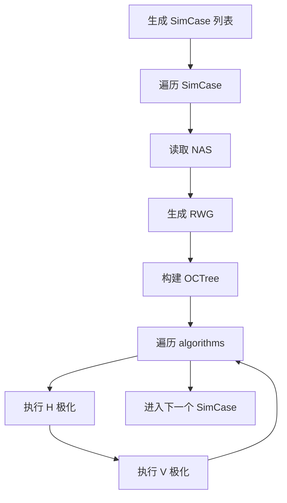

# 多算法批处理改造方案

## 1. 现状分析

当前 `Code/BatchRunner.h` 已经可以完成单一算法下的批处理，核心流程是：

1. `BatchConfigParser::parse()` 从 `batch_config.txt` 读取配置。
2. `BatchConfig::generateTasks()` 将 `nasFiles`、`frequencies`、`incidentAngles` 做组合，生成 `SimTask` 列表。
3. `BatchRunner::run()` 顺序遍历每个 `SimTask`。
4. `executeSingleTask()` 对每个任务依次执行 `h`、`v` 两种极化。
5. 每个极化内部根据 `task.selectAlgorithm` 选择 `MoM`、`FMM` 或 `MLFMM`。

现在只能批处理单一算法的原因是：

- `BatchConfig` 里只有一个 `int selectAlgorithm`。
- `SimTask` 里也只有一个 `int selectAlgorithm`。
- `generateTasks()` 只展开了网格、频率、入射角，没有展开算法维度。
- 配置文件只有 `algorithm = 2` 这种单值写法。

因此，要实现“多个算法下的批处理”，本质是把算法从一个全局单值改成一个可展开的维度。

## 2. 改造目标

建议实现以下能力：

1. 配置文件支持同时指定多个算法，例如：

   ```txt
   algorithms = 0,1,2
   ```

2. 程序生成任务时将算法加入笛卡尔积：

   ```txt
   nas_files × frequencies × incident_angles × algorithms
   ```

3. 保留旧配置兼容性：

   ```txt
   algorithm = 2
   ```

   仍然可以工作。

4. 每个算法继续自动执行 `h`、`v` 两种极化。

5. 输出文件不互相覆盖，并且便于比较不同算法结果。

当前 `RCSExportConfig::toCoreString()` 已经把 `algoStr()` 写入文件名，例如 `MoM`、`FMM`、`MLFMA`，所以多算法输出文件天然可以区分。建议额外引入批处理级时间戳，让同一批任务的输出文件时间戳一致，方便后续整理和对比。

## 3. 推荐的总体设计

### 3.1 最小改造版本

这是最稳妥、改动最小的方案：

- 将 `BatchConfig::selectAlgorithm` 改为 `std::vector<int> selectAlgorithms`。
- 配置解析时新增 `algorithms` 键。
- 保留 `algorithm` 键，解析成只有一个元素的 `selectAlgorithms`。
- `generateTasks()` 增加一层算法循环。
- `BatchRunner::run()` 的任务数量统计改为真实任务数。

流程如下：



这个版本实现简单，风险低，但同一网格、同一频率、同一入射角下切换算法时，会重复读取 NAS、生成 RWG、构建 OCTree。

### 3.2 推荐优化版本

在最小改造版本基础上，进一步把“与算法无关的前处理”抽出来复用：

- NAS 读取。
- RWG 基函数生成。
- `EMSource waveForTree` 初始化。
- `gaussPoints` 构建。
- `OCTree` 构建。

推荐把任务拆成两层：

- `SimCase`：物理场景，不含算法。
- `AlgorithmRun`：算法选择。

即：

```txt
SimCase = nasFile + freq + incidentAngle + scatteringRange + material + solver + gauss + threads
AlgorithmRun = MoM / FMM / MLFMM
```

运行时对每个 `SimCase` 只做一次前处理，然后在同一个前处理上下文中依次跑多个算法。

流程如下：



该版本适合实际长期使用，尤其是 `MoM/FMM/MLFMM` 对同一模型、同一频率做对比时，可以避免大量重复前处理。

## 4. 具体代码改造建议

### 4.1 修改 `BatchConfig`

当前代码：

```cpp
int selectAlgorithm = 2;
```

建议改为：

```cpp
std::vector<int> selectAlgorithms{ 2 };
```

同时保留 `SimTask::selectAlgorithm` 不变，因为单个任务最终仍然只运行一个算法。

### 4.2 修改 `generateTasks()`

当前逻辑只展开：

```cpp
for (const auto& nas : nasFiles) {
    for (double freq : frequencies) {
        for (const auto& [th, ph] : incidentAngles) {
            SimTask task;
            task.selectAlgorithm = selectAlgorithm;
            tasks.push_back(task);
        }
    }
}
```

建议改为：

```cpp
for (const auto& nas : nasFiles) {
    for (double freq : frequencies) {
        for (const auto& [th, ph] : incidentAngles) {
            for (int algo : selectAlgorithms) {
                SimTask task;
                task.nasFile = nas;
                task.freq = freq;
                task.inc_th = th;
                task.inc_ph = ph;
                task.sca_th_s = sca_th_s;
                task.sca_th_f = sca_th_f;
                task.sca_ph_s = sca_ph_s;
                task.sca_ph_f = sca_ph_f;
                task.step = step;
                task.selectAlgorithm = algo;
                task.selectIntegralEqu = selectIntegralEqu;
                task.selectMatrixSolver = selectMatrixSolver;
                task.selectMono_Dual = selectMono_Dual;
                task.N_points = N_points;
                task.epsilonR_real = epsilonR_real;
                task.epsilonR_imag = epsilonR_imag;
                task.muR_real = muR_real;
                task.muR_imag = muR_imag;
                task.ompThreads = ompThreads;
                tasks.push_back(task);
            }
        }
    }
}
```

同时建议在生成任务前校验算法编号：

```cpp
for (int algo : selectAlgorithms) {
    if (algo < 0 || algo > 2) {
        throw std::invalid_argument(
            "Invalid algorithm value: " + std::to_string(algo)
            + " (must be 0 for MoM, 1 for FMM, 2 for MLFMM)");
    }
}
```

### 4.3 修改配置解析

当前只支持：

```cpp
else if (key == "algorithm") {
    cfg.selectAlgorithm = std::stoi(value);
}
```

建议改为同时支持旧写法和新写法：

```cpp
else if (key == "algorithm") {
    cfg.selectAlgorithms.clear();
    cfg.selectAlgorithms.push_back(std::stoi(value));
}
else if (key == "algorithms") {
    cfg.selectAlgorithms.clear();
    for (const auto& s : splitString(value, ',')) {
        cfg.selectAlgorithms.push_back(std::stoi(s));
    }
}
```

为了避免用户误写空值，建议解析结束后补充校验：

```cpp
if (cfg.selectAlgorithms.empty()) {
    cfg.selectAlgorithms.push_back(2);
}
```

### 4.4 修改配置文件示例

旧配置：

```txt
# algorithm: 0 = MoM, 1 = FMM, 2 = MLFMM
algorithm = 2
```

建议改为：

```txt
# algorithm: 0 = MoM, 1 = FMM, 2 = MLFMM
# 旧写法：只运行单一算法
# algorithm = 2

# 新写法：同一批参数下依次运行多个算法
algorithms = 0,1,2
```

如果只想对比 `FMM` 和 `MLFMM`：

```txt
algorithms = 1,2
```

如果只想跑 `MLFMM`，两种写法都可以：

```txt
algorithm = 2
```

或：

```txt
algorithms = 2
```

### 4.5 修改任务数量输出

当前输出：

```cpp
std::cout << "Total tasks: " << tasks.size()
    << " (x2 polarizations = " << tasks.size() * 2 << "runs)\n\n";
```

建议改为更明确：

```cpp
std::cout << "Total task cases: " << tasks.size() << "\n";
std::cout << "Total solver runs: " << tasks.size() * 2
    << " (each task runs H and V polarizations)\n\n";
```

并在每个任务日志中打印算法名称，而不只是数字：

```cpp
static const char* algorithmName(int algo) {
    switch (algo) {
    case 0: return "MoM";
    case 1: return "FMM";
    case 2: return "MLFMM";
    default: return "Unknown";
    }
}
```

日志示例：

```cpp
std::cout << "  Algo: " << algorithmName(task.selectAlgorithm)
    << " (" << task.selectAlgorithm << ")\n";
```

## 5. 推荐的结构性优化

如果希望多算法批处理更高效，建议进一步引入 `PreparedTaskContext`，避免每个算法重复前处理。

### 5.1 新增上下文结构

可以在 `BatchRunner.h` 中增加：

```cpp
struct PreparedTaskContext {
    std::vector<Point> points;
    std::vector<FaceElement> faces;
    std::vector<RWGBase> rwgBases;
    gaussPoints gausspoint;
    OCTree octree;

    PreparedTaskContext(
        const SimTask& task,
        const EMSource& waveForTree)
        : gausspoint(task.N_points),
          octree(rwgBases, waveForTree.wavelength(), task.nasFile) {}
};
```

不过 `OCTree` 构造依赖 `rwgBases`，所以直接这样写还不够自然。更清晰的方式是不要强行把它做成一个简单构造函数，而是增加一个准备函数。

### 5.2 增加前处理函数

推荐拆成：

```cpp
struct PreparedTaskContext {
    std::vector<Point> points;
    std::vector<FaceElement> faces;
    std::vector<RWGBase> rwgBases;
    std::unique_ptr<gaussPoints> gausspoint;
    std::unique_ptr<OCTree> octree;
};
```

然后：

```cpp
static PreparedTaskContext prepareContext(const SimTask& task) {
    PreparedTaskContext ctx;

    if (readNasData(task.nasFile, ctx.points, ctx.faces) != 0) {
        throw std::runtime_error("Failed to read NAS file: " + task.nasFile);
    }

    if (!RWGGenerator::GenerateRWG(ctx.faces, ctx.points, ctx.rwgBases)) {
        throw std::runtime_error("RWG generation failed");
    }

    EMSource waveForTree(task.freq, 90.0);
    std::complex<double> epsilonR(task.epsilonR_real, task.epsilonR_imag);
    std::complex<double> muR(task.muR_real, task.muR_imag);
    if (task.selectIntegralEqu == 2) {
        waveForTree.initDielectric(epsilonR, muR);
    }

    ctx.gausspoint = std::make_unique<gaussPoints>(task.N_points);
    ctx.octree = std::make_unique<OCTree>(
        ctx.rwgBases,
        waveForTree.wavelength(),
        task.nasFile);

    return ctx;
}
```

之后把执行算法拆成：

```cpp
static int executeAlgorithmWithContext(
    const SimTask& task,
    const PreparedTaskContext& ctx);
```

这样在同一 `nasFile + freq + incidentAngle + material` 下，多个算法可以共用 `ctx`。

### 5.3 任务分组

为了复用前处理，可以先生成不含算法的基础任务：

```cpp
struct SimCase {
    std::string nasFile;
    double freq;
    double inc_th, inc_ph;
    // scattering range, material, solver, gauss, threads...
};
```

然后在运行阶段：

```cpp
for (const auto& simCase : cases) {
    PreparedTaskContext ctx = prepareContext(simCase);

    for (int algo : cfg.selectAlgorithms) {
        SimTask task = makeTask(simCase, algo);
        executeAlgorithmWithContext(task, ctx);
    }
}
```

这个改造比最小版本稍大，但性能收益明显，尤其是同一模型下跑 `MoM/FMM/MLFMM` 对比时。

## 6. 输出文件与结果管理

当前输出文件名由 `RCSExportConfig::toCoreString()` 生成，已经包含：

- 算法名：`MoM`、`FMM`、`MLFMA`。
- 材料类型：`PEC`、`Die`。
- 积分方程：`EFIE`、`CFIE`、`PMCHWT`。
- 极化：`H`、`V`。
- 入射角、散射角、步进。

因此多算法结果不会因为算法不同而覆盖。

但建议引入批处理级时间戳：

```cpp
std::string batchRunId = getCurrentTimeString();
```

然后给每个 `RCSExportConfig` 设置固定时间戳：

```cpp
cfg.setFixedTimeStamp(batchRunId);
```

这样同一批任务的结果文件会共用同一个时间戳，不同算法依靠文件名中的 `MoM/FMM/MLFMA` 区分。后续做结果对比时，筛选同一个 `batchRunId` 会更方便。

如果担心同一秒内重复运行导致覆盖，可以把 `batchRunId` 扩展为：

```txt
20260702_153012_batch
```

或者增加一个配置项：

```txt
run_id = compare_mom_fmm_mlfmm_case01
```

## 7. 配置文件最终建议格式

建议将 `Code/batch_config.txt` 调整为以下风格：

```txt
# ============ 网格文件 ============
nas_files = D:\MyCode\PMCHWT_MLFMA\DATA\Sphere_1e9\Sphere_1e9.nas

# ============ 频率列表 Hz ============
frequencies = 1.0e9

# ============ 入射角 ============
incident_angles = 90:0, 60:0, 45:0, 30:0

# ============ 散射角范围 ============
sca_theta = 90:90
sca_phi = 0:360
step = 1

# ============ 多算法批处理 ============
# 0 = MoM, 1 = FMM, 2 = MLFMM
algorithms = 0,1,2

# ============ 仿真参数 ============
# 0 = EFIE, 1 = CFIE, 2 = PMCHWT
integral_equation = 1

# 0 = GMRES, 1 = CGS
matrix_solver = 1

mono_dual = dual
gauss_points = 7
omp_threads = 14

# ============ 介质参数，仅 PMCHWT 时有效 ============
# epsilon_r = 4.0, -0.001
# mu_r = 1.0, 0.0
```

## 8. 兼容性与边界条件

### 8.1 旧配置兼容

必须继续支持：

```txt
algorithm = 2
```

原因是当前项目已经有这个配置习惯，直接移除会让旧配置失效。

建议规则：

- 如果只出现 `algorithm`，按单算法运行。
- 如果只出现 `algorithms`，按多算法运行。
- 如果两者都出现，建议以最后解析到的配置为准，或者明确规定 `algorithms` 优先。

更推荐的规则是：`algorithms` 优先，并在日志中提示。

### 8.2 算法取值校验

必须校验：

```txt
0 = MoM
1 = FMM
2 = MLFMM
```

遇到其他值应直接报错，而不是静默跳过。

### 8.3 大规模 MoM 风险

`MoM` 对内存要求明显高于 `FMM/MLFMM`。多算法批处理里如果包含 `0`，但网格规模很大，可能出现内存不足或计算时间过长。

建议在文档或日志中提示：

```txt
Warning: MoM may require large memory for large meshes.
```

后续可以增加配置开关：

```txt
skip_mom_if_rwg_over = 5000
```

当 RWG 数量超过阈值时自动跳过 `MoM`。

### 8.4 积分方程组合

当前方案默认所有算法共享同一个 `integral_equation`、`matrix_solver`、`mono_dual`。这适合第一阶段。

如果未来要实现“不同算法使用不同求解器或积分方程”，可以引入算法运行配置：

```txt
algorithm_cases = 0:1:0, 1:1:0, 2:1:0
```

含义：

```txt
algorithm:integral_equation:matrix_solver
```

但第一阶段不建议直接做这么复杂，容易增加解析和校验成本。

## 9. 建议实施步骤

### 第一步：实现最小多算法展开

修改点：

- `BatchConfig::selectAlgorithm` 改为 `selectAlgorithms`。
- `BatchConfigParser` 新增 `algorithms` 解析。
- `generateTasks()` 增加算法循环。
- 日志显示算法名称。
- 更新 `batch_config.txt` 示例。

完成后即可使用：

```txt
algorithms = 0,1,2
```

### 第二步：增加批处理级时间戳

修改点：

- 在 `BatchRunner::run()` 开始处生成 `batchRunId`。
- 将 `batchRunId` 传入 `executeSingleTask()`。
- 创建 `RCSExportConfig cfg(task.nasFile)` 后调用：

  ```cpp
  cfg.setFixedTimeStamp(batchRunId);
  ```

这样同一批输出更容易管理。

### 第三步：抽取算法执行函数

把 `executeSingleTask()` 内部的算法选择拆成独立函数：

```cpp
static void runSelectedAlgorithm(
    const SimTask& task,
    const RCSExportConfig& cfg,
    const std::string& pol,
    const OCTree& octree,
    const std::vector<RWGBase>& rwgBases,
    const gaussPoints& gausspoint,
    double E0,
    const EMSource& wave);
```

好处是：

- `executeSingleTask()` 更短。
- 后续复用前处理上下文更容易。
- 新增算法时只改一个函数。

### 第四步：做前处理复用

当最小版本验证通过后，再把 NAS/RWG/OCTree 前处理从单个算法任务中抽出，改成每个物理场景只做一次。

推荐先不急着做这一步，因为它会牵涉函数签名和对象生命周期，改动面比第一阶段更大。

## 10. 推荐最终效果

执行：

```powershell
.\MLFMA.exe batch Code\batch_config.txt
```

配置：

```txt
nas_files = D:\MyCode\PMCHWT_MLFMA\DATA\Sphere_1e9\Sphere_1e9.nas
frequencies = 1.0e9
incident_angles = 90:0, 60:0
algorithms = 0,1,2
```

任务数量应为：

```txt
1 nas × 1 frequency × 2 incident angles × 3 algorithms = 6 tasks
```

实际求解次数为：

```txt
6 tasks × 2 polarizations = 12 solver runs
```

日志应类似：

```txt
Total task cases: 6
Total solver runs: 12 (each task runs H and V polarizations)

[Task 1/6]
  NAS: ...
  Freq: 1 GHz
  Inc: theta=90, phi=0
  Algo: MoM (0)
  Polarization: h -> v (sequential)

[Task 2/6]
  Algo: FMM (1)

[Task 3/6]
  Algo: MLFMM (2)
```

输出文件中应能看到：

```txt
..._MoM_PEC_CFIE_Dual_H_...
..._FMM_PEC_CFIE_Dual_H_...
..._MLFMA_PEC_CFIE_Dual_H_...
```

这样就可以在同一套模型、频率、入射角、散射角参数下，自动完成多个算法的批处理计算，并保留可对比的输出结果。

## 11. 结论

建议先采用“最小改造版本”落地多算法批处理，因为它与当前代码结构最匹配，改动集中在 `BatchRunner.h` 和 `batch_config.txt`，风险最低。

等多算法任务展开、输出文件和日志都验证无误后，再推进“前处理复用”优化。这样可以先快速获得可用能力，再逐步减少重复读取 NAS、生成 RWG 和构建 OCTree 的时间成本。
